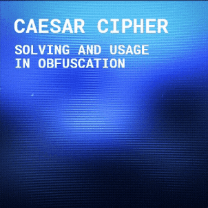

# Definition
sfsdfsdfsdfsd

# Formula

**Encryption**\
dfgfdgfdgfdgfdgfd fdgfdgd
$$\left( \sum_{k=1}^n a_k b_k \right)^2 \leq \left( \sum_{k=1}^n a_k^2 \right) \left( \sum_{k=1}^n b_k^2 \right)$$

**Decryption**\
dfgfdgfdgfdgfdgfd fdgfdgd
$$\left( \sum_{k=1}^n a_k b_k \right)^2 \leq \left( \sum_{k=1}^n a_k^2 \right) \left( \sum_{k=1}^n b_k^2 \right)$$

**P Sovling**\
dfgfdgfdgfdgfdgfd fdgfdgd
$$\left( \sum_{k=1}^n a_k b_k \right)^2 \leq \left( \sum_{k=1}^n a_k^2 \right) \left( \sum_{k=1}^n b_k^2 \right)$$

# P Sovling Algorithm

## Mathematical Procedure

## Psydocode

## Rust Implementation

# Obfuscation Matrix
